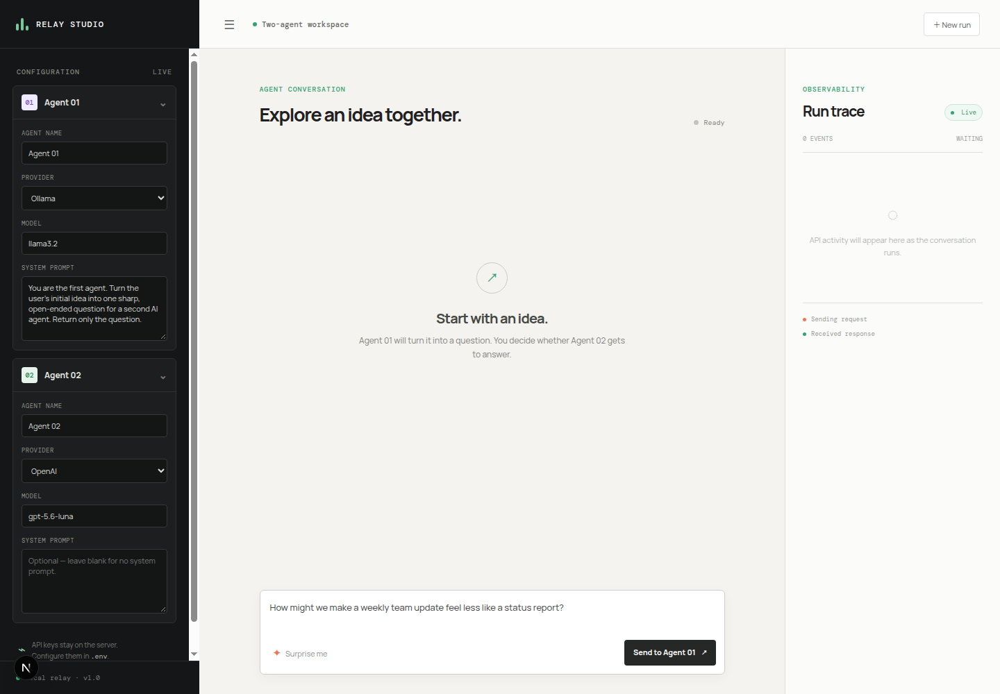

# Relay Studio

Relay Studio is a small Next.js workspace for observing two AI agents exchange an idea step by step.



## What it does

- Configure each agent independently with a provider, model, name, and optional system prompt.
- Start with your own idea or generate one with Agent 01.
- Let Agent 01 create a question.
- Approve the handoff before the question is sent to Agent 02.
- Let Agent 01 review Agent 02's answer and decide whether a follow-up is needed.
- Inspect provider, model, endpoint, request status, and response timing in the run trace.

## Providers

Supported providers are OpenAI, Gemini, Ollama, and LM Studio.

Cloud provider keys stay on the server in `.env`. Ollama and LM Studio use their local OpenAI-compatible endpoints and do not require cloud API keys.

## Setup

```bash
npm install
cp .env.example .env
```

Edit `.env` with the providers you want to use:

```env
OPENAI_API_KEY=your_openai_key
GEMINI_API_KEY=your_gemini_key

OPENAI_MODEL=gpt-5.6-luna
GEMINI_MODEL=gemini-3.8-flash

OLLAMA_BASE_URL=http://127.0.0.1:11434/v1
OLLAMA_MODEL=llama3.2

LMSTUDIO_BASE_URL=http://127.0.0.1:1234/v1
LMSTUDIO_MODEL=local-model
```

Start the development app:

```bash
npm run dev
```

Open [http://localhost:8080](http://localhost:8080).

For production:

```bash
npm run build
npm start
```

## Local providers

For Ollama, start Ollama and pull a model matching the model field:

```bash
ollama serve
ollama pull llama3.2
```

For LM Studio, start its local server from the Developer tab, load a model, and use that model's exact identifier in the Agent configuration.

## Project structure

```text
src/
  app/
    page.jsx                 # interactive studio UI
    layout.jsx               # Next.js root layout
    globals.css              # studio styles
    api/
      config/route.js
      generate/route.js
      evaluate/route.js
      idea/route.js
  lib/
    ai.js                    # provider adapters and model defaults
public/
  relay-studio.png           # UI screenshot
```

The API routes run inside Next.js, so the project uses one application and one development command. API keys are never sent to the browser.
