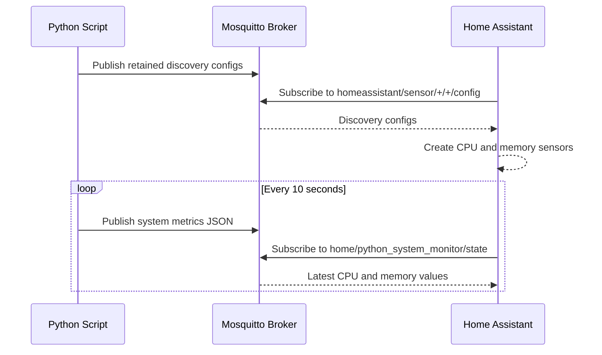

# Home Assistant MQTT System Monitor

Publishes CPU and memory usage to Home Assistant over MQTT using MQTT Discovery.

Home Assistant will discover one device named `Python System Monitor` with these diagnostic sensors:

- CPU Usage
- Memory Usage
- Memory Used
- Memory Available

## Setup

Install dependencies:

```bash
pip install -r requirements.in
```

Create a local environment file:

```bash
cp .env.example .env
```

Edit `.env` for your MQTT broker:

```env
MQTT_HOST=homeassistant.local
MQTT_PORT=1883
MQTT_USER=your_mqtt_user
MQTT_PASSWORD=your_mqtt_password
```

If your broker allows anonymous access, leave `MQTT_USER` empty or remove it:

```env
MQTT_USER=
MQTT_PASSWORD=
```

## Run

```bash
python3 ha_mqtt_system_monitor.py
```

## MQTT Payload Flow

```text
Python script -> Mosquitto broker -> Home Assistant
```



| Purpose | Topic | Retain |
| --- | --- | --- |
| Sensor discovery config | `homeassistant/sensor/python_system_monitor/<sensor>/config` | Yes |
| CPU and memory values | `home/python_system_monitor/state` | Yes |

Example state payload:

```json
{
  "cpu_percent": 12.5,
  "memory_percent": 64.3,
  "memory_used_mib": 8120.4,
  "memory_available_mib": 4521.8
}
```

Each Home Assistant sensor reads one field from the shared state payload using its discovery `value_template`.

## Configuration

| Variable | Default | Description |
| --- | --- | --- |
| `MQTT_HOST` | `homeassistant.local` | MQTT broker hostname or IP address |
| `MQTT_PORT` | `1883` | MQTT broker port |
| `MQTT_USER` | empty | MQTT username; auth is skipped when empty |
| `MQTT_PASSWORD` | empty | MQTT password |
| `DEVICE_ID` | `python_system_monitor` | Stable Home Assistant device/entity ID prefix |
| `DEVICE_NAME` | `Python System Monitor` | Device name shown in Home Assistant |
